# Overview


<!-- 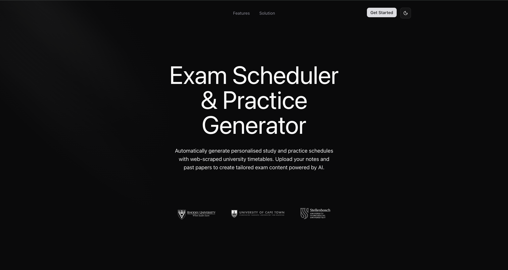 -->

# User Interface
### Onboarding Screens

| Welcome |  
|-------------------| 
|  

| Login | Sign Up |
|--------|--------|
| 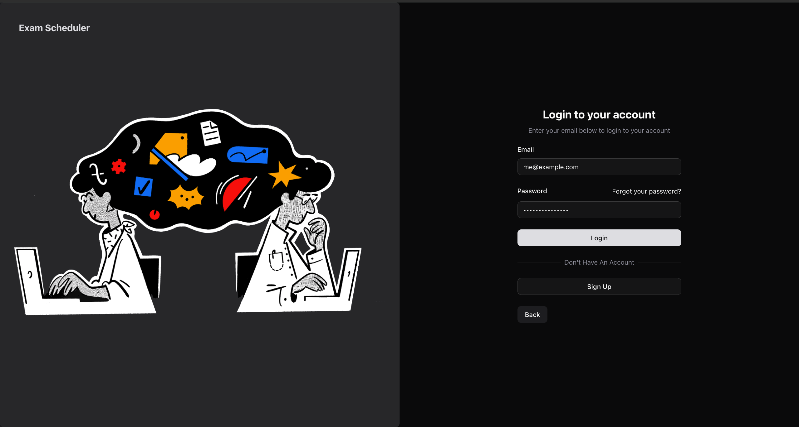 | 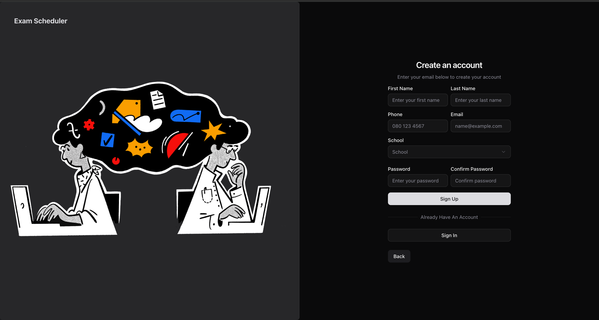 |


### Dashboard Screens

| All Kanban Overview | Single Kanban Overview |
|--------|--------|
| 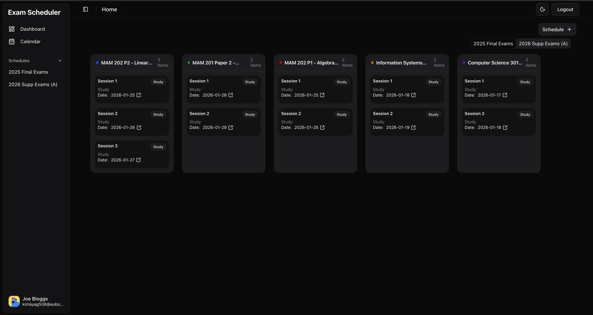 | 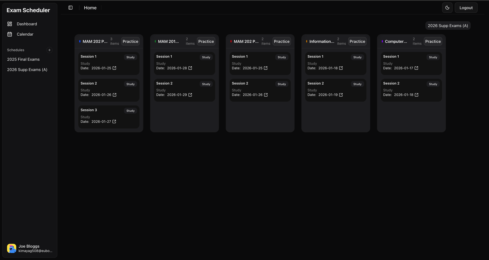 |


| Exams | Create Exam |
|-------------------|-------|
| 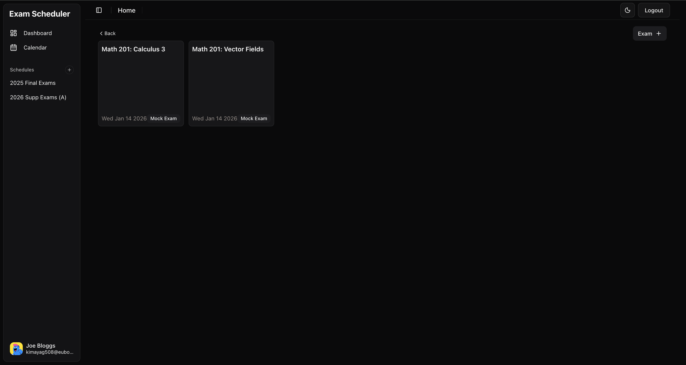 |  |


| Exam Content | Exam Content B |
|--------|--------|
| 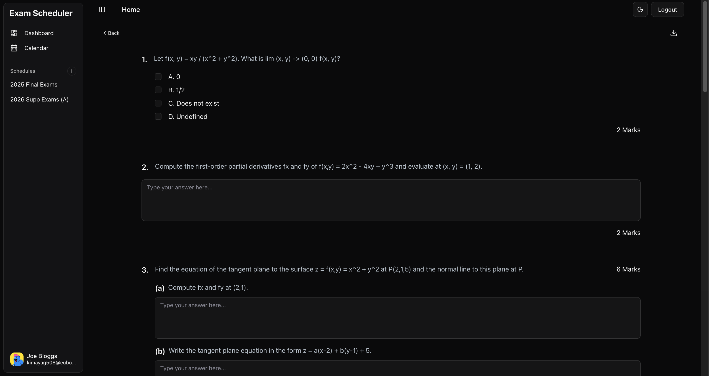 | 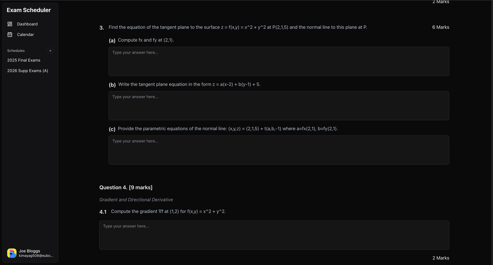 |

| Create Exam  | Exam Content  |
|--------|--------|
| 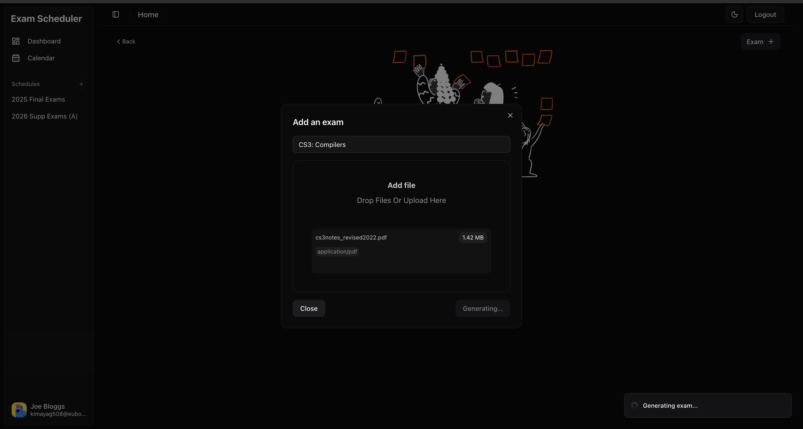 | 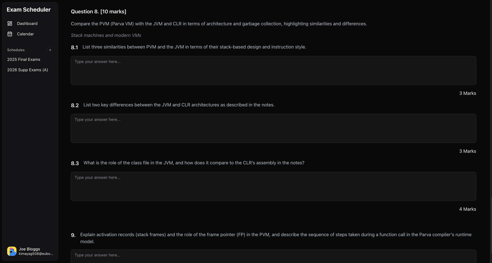 |

### Calendar Screens

| Agenda | Calendar|
|--------|--------|
| 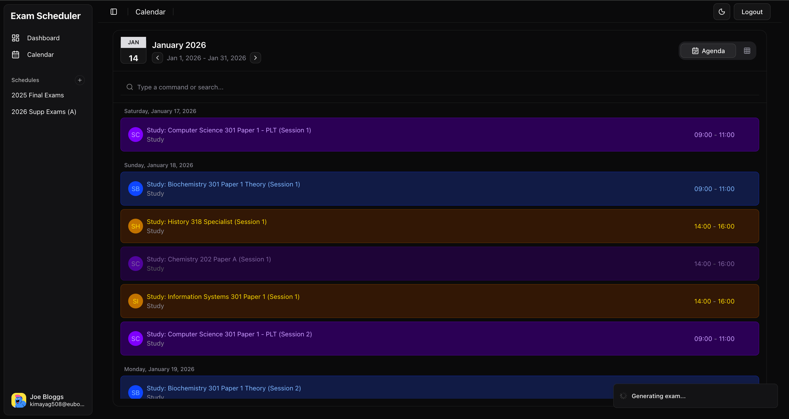 | 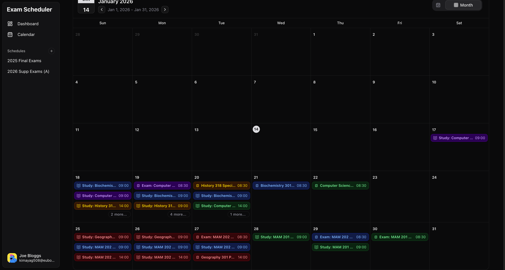 |

| All Kanban Overview | Single Kanban Overview |
|--------|--------|
| 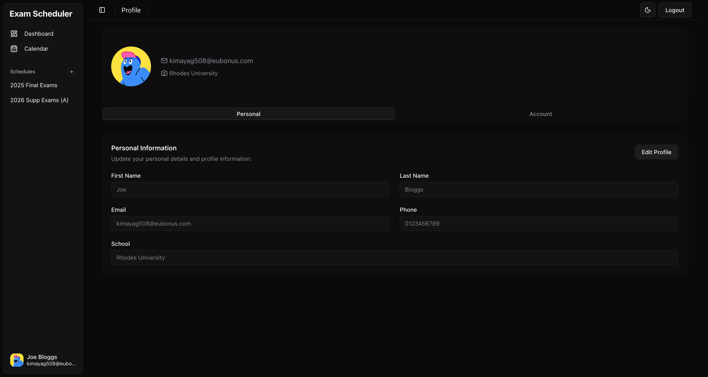 |  |

### Profile
| Profile | Profile Delete |
|--------|--------|
|  | 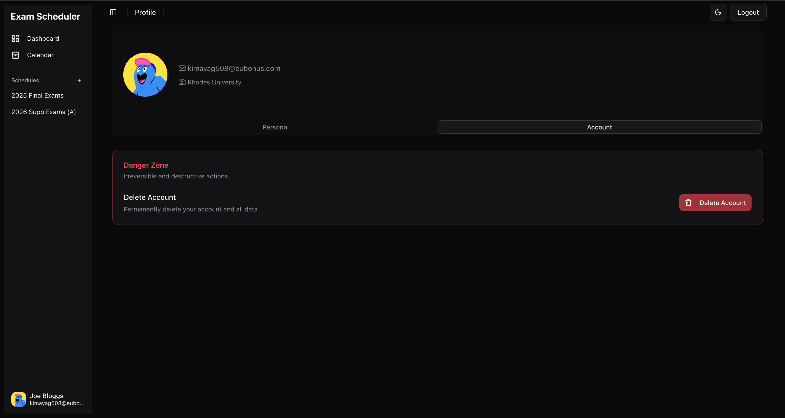 |

# Backend Architecture

--

### Folder Structure & Tech Stack
```
├── core-service
│   ├── Controllers
│   ├── Data
│   ├── Infrastructure
│   ├── Models
│   └── Services
└── ai-service
    ├── src
    │   ├── config
    │   ├── controllers
    │   ├── db
    │   ├── llm
    │   ├── mappers
    │   ├── routes
    │   └── services
    └── package.json
```

| Language | Framework / Runtime |
|----------|---------------------|
| C# | ASP.NET Core |
| TypeScript | NodeJS (Express)  |
| SQL | PostgreSQL (EF Core) |

<br>


### Authentication & Authorization
--

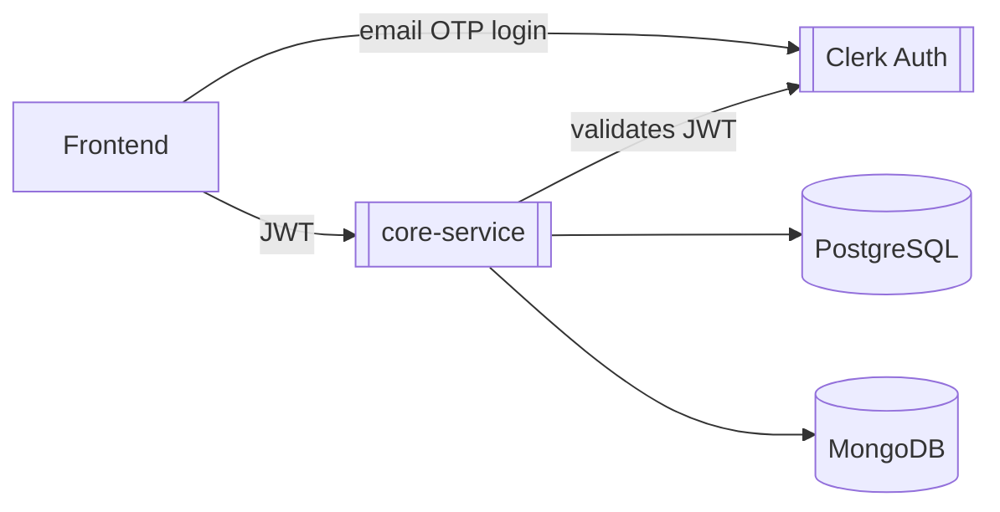

### Sign in/Sign up Sequence
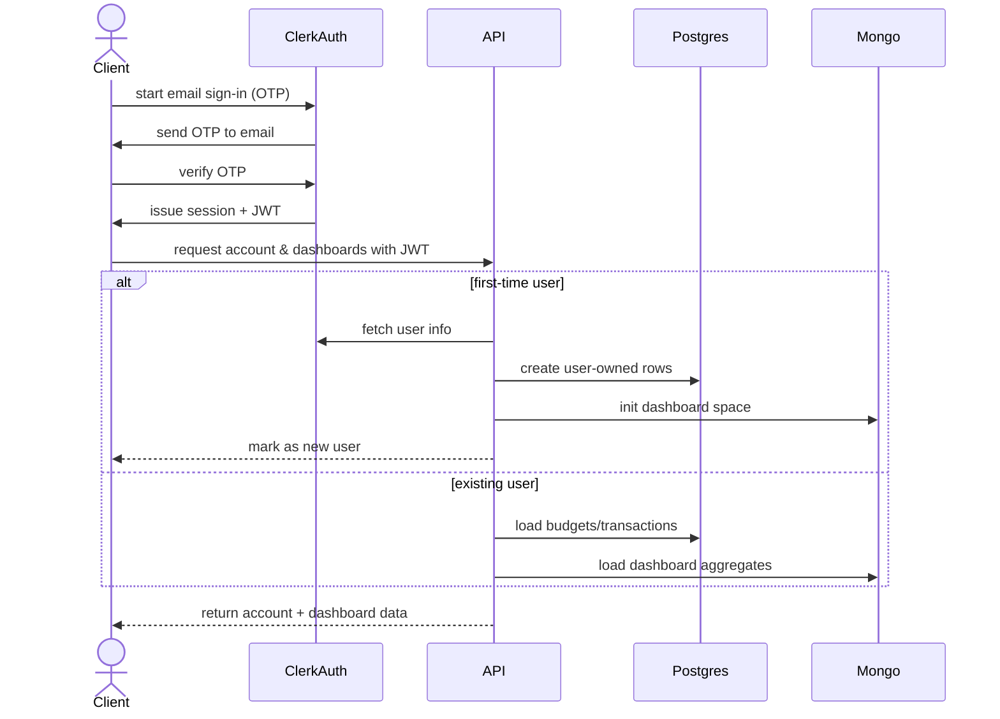

### Ingestion & AI Pipeline
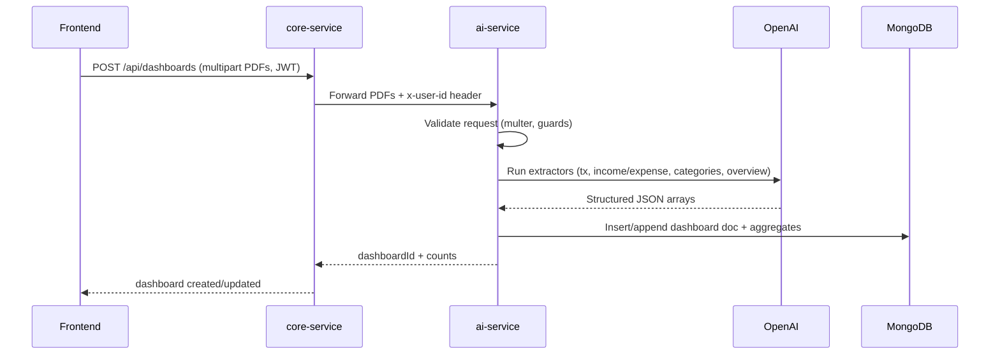

### Data Flow
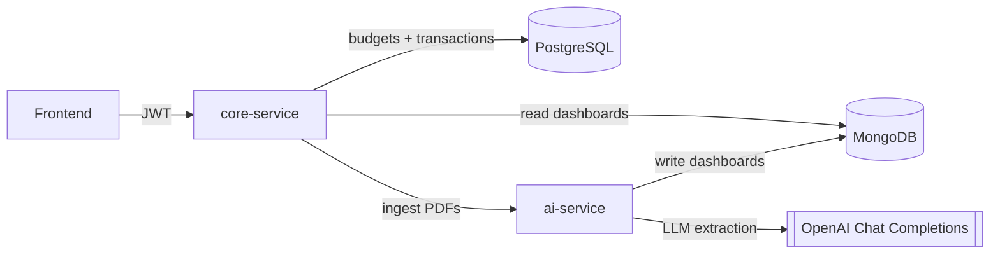
