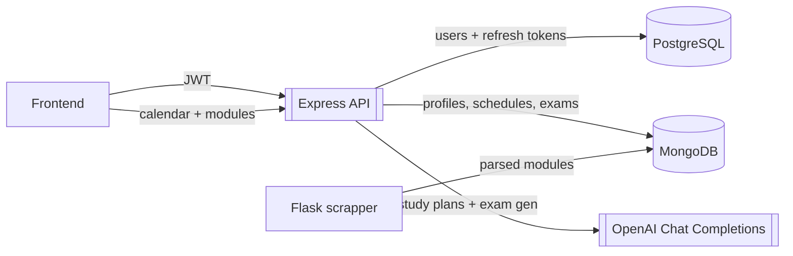
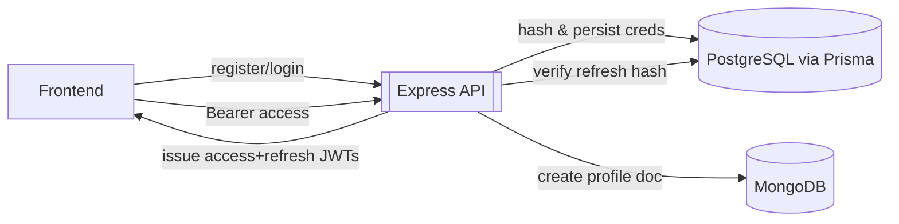
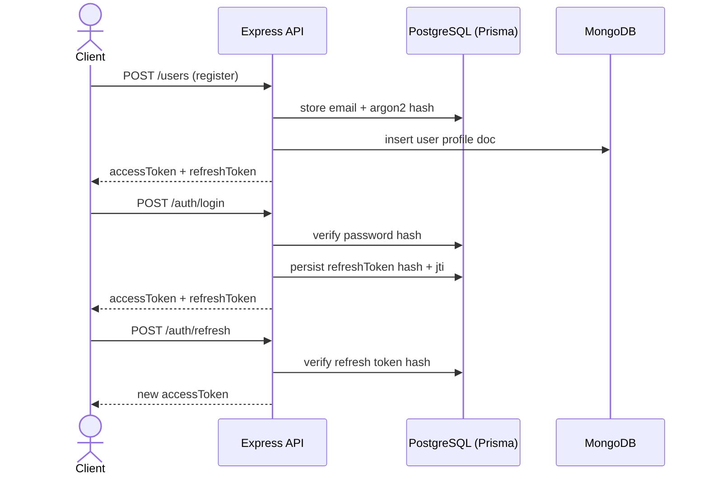
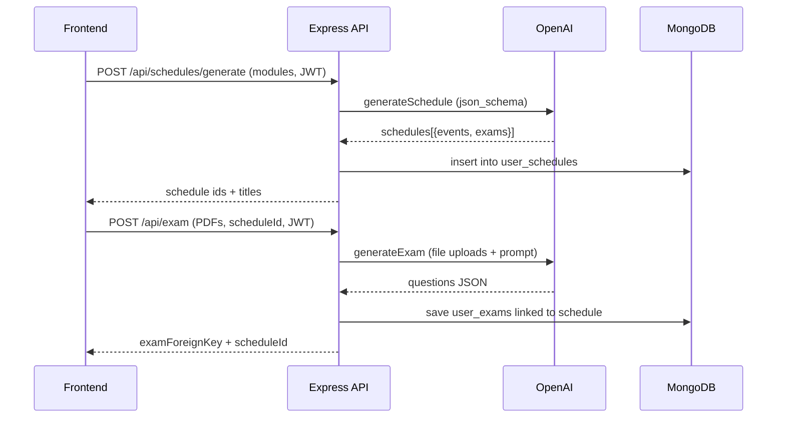
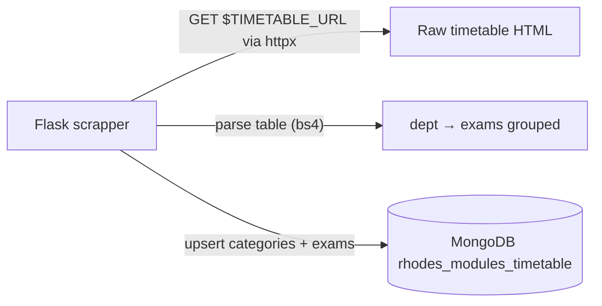

# Overview

   Automatically generate personalised study and practice
                    schedules with web-scraped university timetables. Upload
                    your notes and past papers to create practice exams exam content
                    powered by AI.


# User Interface
### Onboarding Screens

| Welcome |  
|-------------------| 
|  

| Login | Sign Up |
|--------|--------|
|  |  |


### Dashboard Screens

| All Kanban Overview | Single Kanban Overview |
|--------|--------|
|  |  |


| Exams | Create Exam |
|-------------------|-------|
|  |  |


| Exam Content | Exam Content B |
|--------|--------|
|  |  |

| Create Exam  | Exam Content  |
|--------|--------|
|  |  |

### Calendar Screens

| Agenda | Calendar|
|--------|--------|
|  |  |

| All Kanban Overview | Single Kanban Overview |
|--------|--------|
|  |  |

### Profile
| Profile | Profile Delete |
|--------|--------|
|  |  |

# Backend Architecture


### Folder Structure & Tech Stack
```
├── backend
│   ├── prisma
│   ├── src
│   │   ├── controllers
│   │   ├── db
│   │   ├── middleware
│   │   ├── models
│   │   ├── routes
│   │   ├── services
│   │   ├── utils
│   │   └── validations
│   └── uploads
└── scrapper
    ├── app.py
    ├── db.py
    ├── schemas.py
    └── scrapper
        ├── parse.py
        ├── persist.py
        └── jobs.py
```

| Language | Framework / Runtime |
|----------|---------------------|
| TypeScript | NodeJS (Express), Prisma ORM |
| Python | Flask,  BeautifulSoup |
| SQL | PostgreSQL |
| NoSQL | MongoDB |


<br>


### Overview of Data Flow

### Authentication & Authorization
Email/password auth with Argon2 hashes in Postgres via Prisma; refresh tokens are hashed+stored with JTIs, access tokens are short-lived JWTs. MongoDB holds the profile document; `requireAuth` checks a valid bearer token plus an active refresh token record.



### Sign in/Sign up Sequence


### Ingestion & AI Pipeline


### Scrapper Flow



